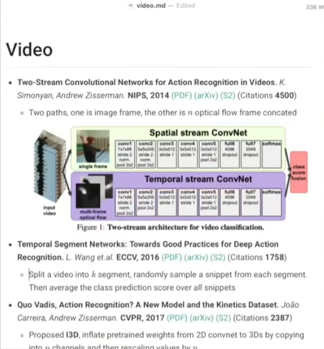
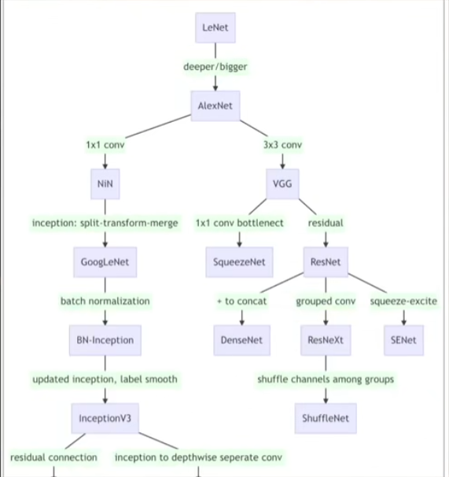

# 阅读整理文献方法

## 1. 如何快速阅读和整理文献

> https://www.bilibili.com/video/BV1nA41157y4

利用 markdown 收集整理文献
- 每篇论文添加简单笔记，重要图表，重要公式
- 多篇论文相互关联，简要标记改进点

工具：typora，markdown，mermaid，[arxiv_tool](https://github.com/huxycn/arxiv_tool)

## 2. 如何精读论文

> https://www.bilibili.com/video/BV1H44y1t75x

1. title (author)
2. abstract
3. introduction
4. **method**: figures / tables
5. **experiments**: figures / tables
6. conclusion

- 第一遍：标题、摘要、结论。可以看一看方法和实验部分重要的图和表。这样可以花费十几分钟时间了解到论文是否适合你的研究方向。
- 第二遍：确定论文值得读之后，可以快速的把整个论文过一遍，不需要知道所有的细节，需要了解重要的图和表，知道每一个部分在干什么，圈出相关文献。觉得文章太难，可以读引用的文献。
- 第三遍：提出什么问题，用什么方法来解决这个问题。实验是怎么做的。合上文章，回忆每一个部分在讲什么。